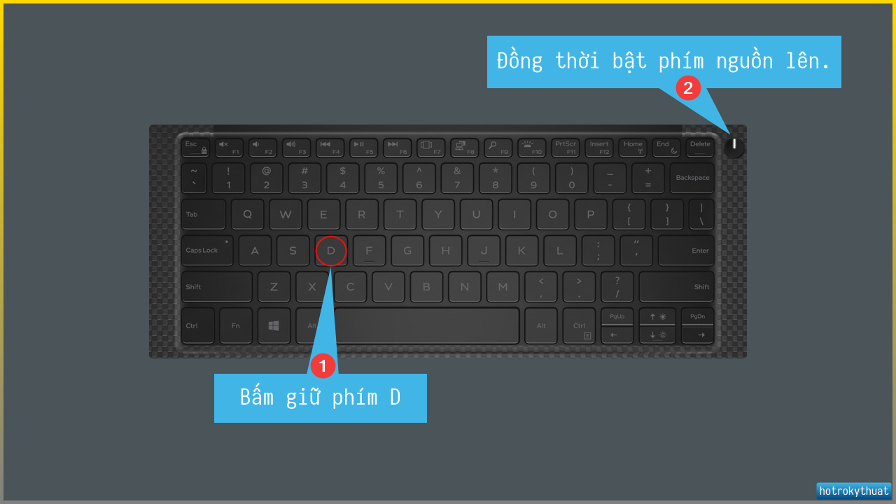
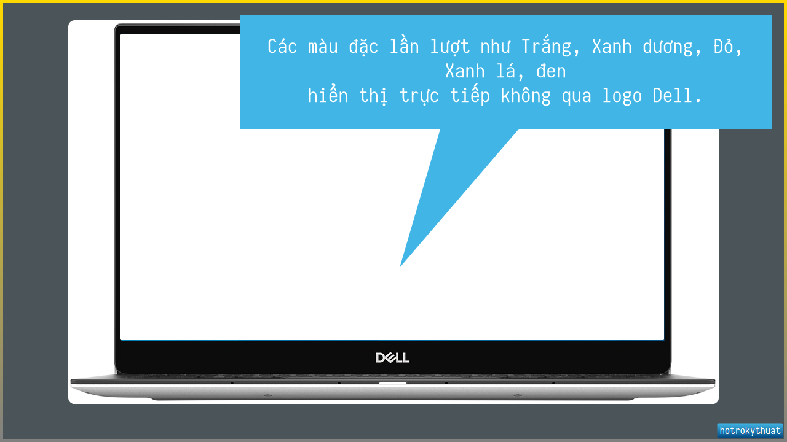

Hướng dẫn sử dụng LCD BIST - Kiểm tra màn hình trên máy tính Dell.

## Giới thiệu

## Các bước thực hiện tạo bộ cài đặt Windows

### LCD BIST Laptop Dell

1. Nhấn giữ phím **D** đồng thời bật nút nguồn lên.

   

2. Màn hình bắt đầu hiển thị các màu đặc toàn màn hình, không đi qua logo Dell.

   

3. Aa